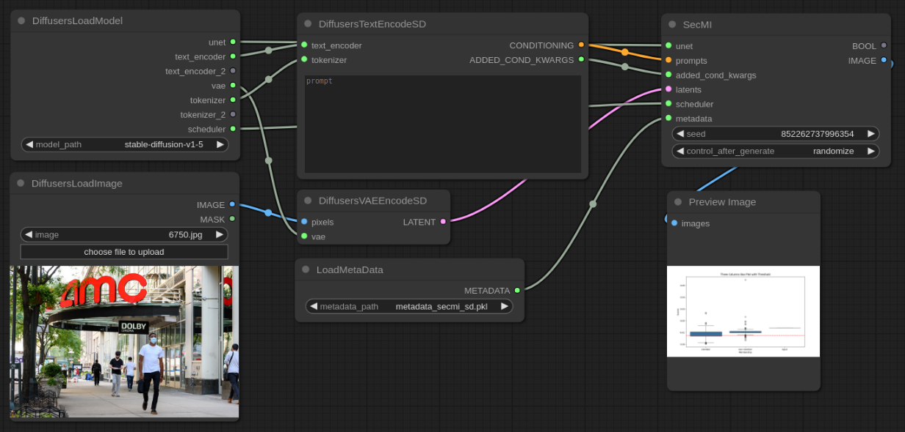
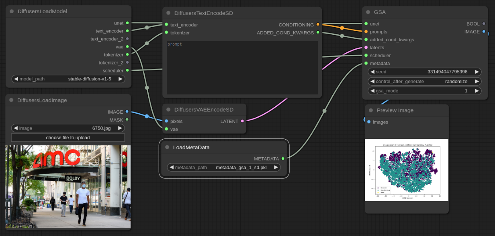

CopyMark UI
=================
Based on [ComfyUI](https://github.com/comfyanonymous/ComfyUI), we provide a graphical user interface (GUI) for copyright detection of diffusion models, namely CopyMark UI. 

Installation
----------------
We provide two approaches to install CopyMark UI:

## 1: ComfyUI + CopyMark (Recommended)

First, follow the [installation guideline of ComfyUI](https://github.com/comfyanonymous/ComfyUI?tab=readme-ov-file#installing) to install ComfyUI.

Second, cover `custom_nodes/` with files in the `custom_nodes/` in this repository.

Third, create a new directory `diffusers` under the folder `models/`. Put model checkpoints under `diffusers`. 


## 2: Build from scratch

Clone this repository and run the following command in the root:

```
    pip install -r requirements.txt
```

Booting
----------------

```
    python main.py 
```

We provide metadata for Stable Diffusion v1.5 in `custom_nodes/assets/`.


Examples
----------------
Here, we show two examples of copyright detection, SecMI and GSA, as follows. 





